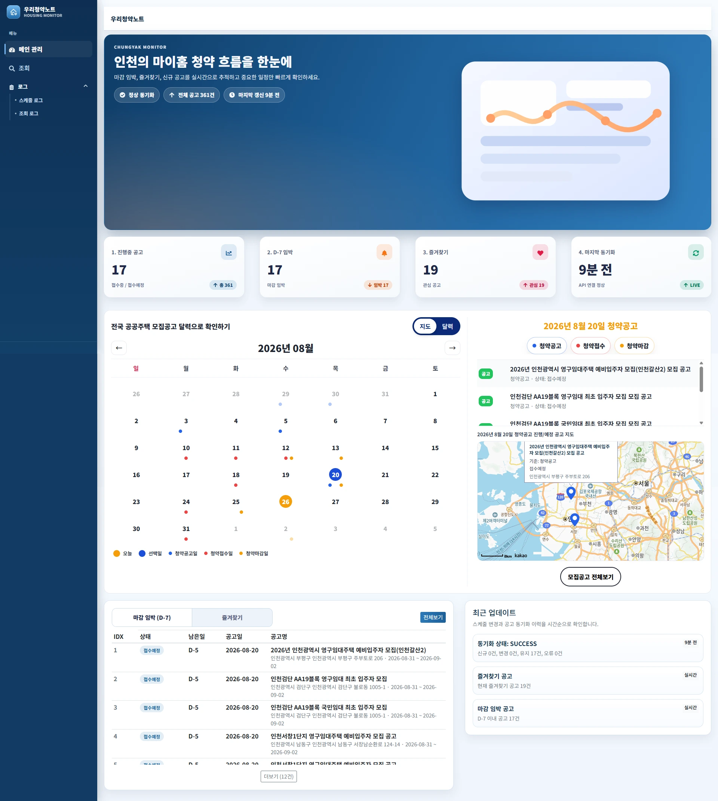
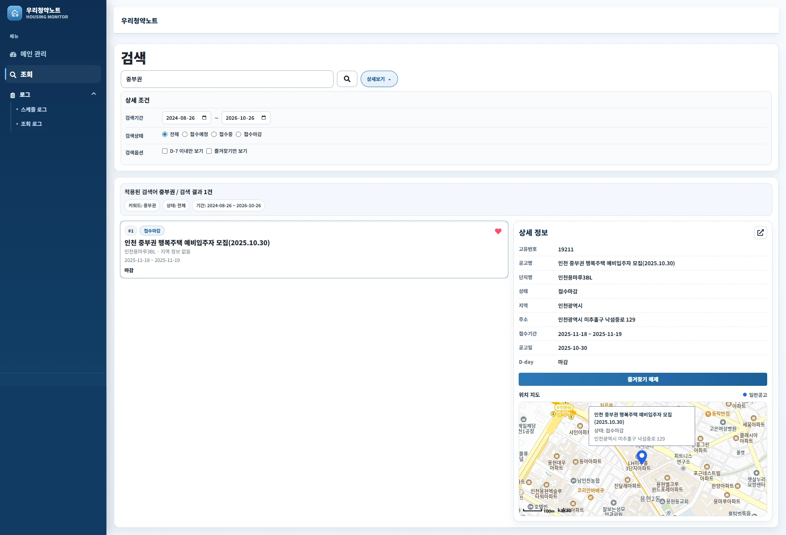
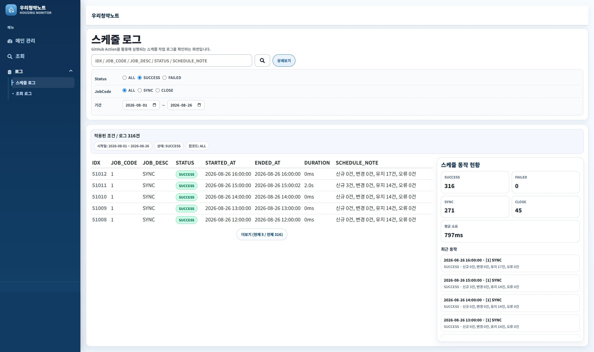
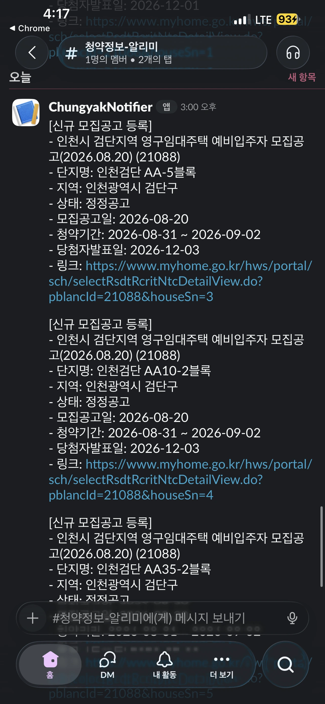

# 🏡 청약알리미 (ChungyakManager)

> **바쁜 하루 속에서도, 중요한 청약 정보만큼은 놓치고 싶지 않았다.**  
> 결혼을 준비하며 직접 집과 청약 정보를 관리하던 경험에서 시작한 개인 프로젝트입니다.

<p align="center">
  <a href="https://ourchungyak.silee.net/">
    
  </a>
</p>

---

## 💛 왜 만들었을까?

결혼 준비 과정에서 **집과 청약·임대 관련 정보는 내가 직접 확인하고 관리하기로 했다.**

하지만 실제로 해보니

- 공고를 매일 직접 확인해야 했고
- 신규/변경 공고를 놓치기 쉬웠으며
- 마감일·발표일 같은 주요 일정을 따로 관리해야 했다

그래서 생각했다.

> **“내가 직접 확인하지 않아도, 필요한 정보만 알아서 알려주면 되지 않을까?”**

그 생각에서 청약알리미를 만들기 시작했다.

단순히 만들어보는 데서 끝나지 않고 **실제로 이 서비스를 사용해 공고를 확인하고 관리했고, 현재 살고 있는 집도 이 과정을 통해 구했다.**

---

## 🎯 이 앱이 해결하는 문제

- 반복적인 공고 확인
- 신규/변경 공고 누락
- 마감일·발표일 등 일정 관리
- 관심 공고의 별도 관리

즉, **사람이 반복해서 확인하고 기록하던 일을 시스템이 대신하도록 만드는 것**이 목표다.

---

## 📸 Preview

<details>
<summary><b>Dashboard 보기</b> — 공고 현황 · 일정 · 마감 임박 · 지도 · 최근 동기화 상태</summary>
<br/>
<p align="center">
  
</p>
</details>

<details>
<summary><b>Search & Detail 보기</b> — 공고 검색 · 상세 조건 · 즐겨찾기 · 위치 지도</summary>
<br/>
<p align="center">
  
</p>
</details>

<details>
<summary><b>Schedule Log 보기</b> — 1시간 주기 수집 및 마감 작업 실행 결과</summary>
<br/>
<p align="center">
  
</p>
</details>

<details>
<summary><b>Slack Notification 보기</b> — 신규 모집공고 자동 알림</summary>
<br/>
<p align="center">
  
</p>
</details>

### Demo

> `대시보드 → 검색 → 상세 → 즐겨찾기/알림` 흐름의 짧은 GIF를 추가할 예정입니다.

---

## 🔧 주요 기능

- **대시보드** — 공고 현황, 캘린더, 마감 임박, 지도 기반 조회
- **검색 / 상세** — 키워드·상태·D-Day 검색, 상세 정보 및 지도 확인
- **즐겨찾기** — 관심 공고 관리 및 알림 대상 연계
- **자동 수집 / 동기화** — 공공 API 수집, DB 비교 및 신규/변경 데이터 반영
- **자동 마감** — 종료일 기준 공고 상태 자동 갱신
- **Slack 알림** — 주요 일정 알림 발송 및 발송 이력 저장
- **로그 조회** — 최근 동기화 및 스케줄 실행 결과 확인
- **자동 스케줄링** — API 서버 내부에서 1시간 주기로 작업 실행
- **운영** — Vercel 프론트 + 홈서버 Docker API 분리 운영

---

## 👤 현재 운영 범위

현재는 **개인 사용을 목적으로 실제 운영 중인 서비스**입니다.

- 관리자/일반 사용자 구분 기능 없음
- 회원가입 및 다중 사용자 계정 기능 없음
- Slack 알림은 개인 워크스페이스 기준으로 운영하며, 외부 사용자 초대 기능 없음

따라서 현재 버전은 다중 사용자 서비스보다는 **개인 청약 관리 자동화 도구**에 초점을 맞추고 있습니다.

---

## 🛠️ 기술 요약

### Front-End
`React` `TypeScript` `Vite` `React-Bootstrap`

### Back-End
`C#` `ASP.NET Core Web API`

### Database / Infra
`Azure SQL` `Docker` `Vercel` `GitHub Actions` `Slack Webhook` `Home Server`

### Repository
- **Frontend** — [chungyak_manage_web](https://github.com/leesein1/chungyak_manage_web)
- **Backend API** — [08.SeinServices.Api](https://github.com/leesein1/08.SeinServices.Api)

---

## 🧩 설계 방향

### 1️⃣ 직접 확인 → 자동 수집
외부 API를 주기적으로 호출하고 기존 DB와 비교해 공고를 자동 동기화한다.

### 2️⃣ 눈으로 비교 → 데이터 비교
신규 공고와 일정·상태 변경 여부를 DB 데이터 차이로 판단한다.

### 3️⃣ 직접 관리 → 자동 처리
공고 종료일을 기준으로 마감 상태를 자동 갱신한다.

### 4️⃣ 직접 확인 → 알림
즐겨찾기 공고의 주요 일정을 Slack으로 전달하고 발송 이력을 저장한다.

### 5️⃣ 외부 스케줄러 → 서버 내부 스케줄링
Azure와 GitHub Actions의 운영 제약을 거친 뒤, 현재는 홈서버의 API 내부 스케줄러가 1시간마다 직접 작업을 수행하도록 구성했다.

---

## 🏗️ 동작 구조

```text
Home Server / Docker
    SeinServices.Api
          │
          ├─ 1시간 주기 Scheduler
          │
          ▼
   공공주택 Open API
          │
          ▼
   공고 수집 / DB 동기화
          │
     ┌────┼─────────┐
     ▼    ▼         ▼
   마감   알림     실행 로그
          │
          ▼
        Slack
          │
          ▼
       Azure SQL
          │
          ▼
 Chungyak Manager Web
 Dashboard / Search / Detail / Logs
```

프론트는 Vercel, 백엔드는 홈서버의 Docker 환경에서 분리 운영한다.

---

## 🔍 트러블슈팅

### Azure 무료 환경의 휴면과 스케줄링 구조 변경

초기에는 Azure App Service 무료 환경을 사용했지만, 유휴 상태에서 앱이 휴면에 들어가 스케줄 작업이 원하는 시점에 실행되지 않는 문제가 있었다.

이를 해결하기 위해 GitHub Actions에서

`wake-up 요청 → 잠시 대기 → 실제 스케줄 API 호출`

방식을 적용했다.

하지만 Actions의 scheduled workflow 역시 정각 실행을 항상 보장하지 않아, 최종적으로 사용하지 않던 노트북을 홈서버로 구성하고 API를 Docker로 이전했다. 현재는 **ASP.NET Core BackgroundService가 1시간마다 직접 작업을 실행**한다.

### UTC / KST 시간 차이

Azure SQL의 시간 기준과 한국 시간 차이 때문에 일부 공고의 마감 상태가 예상 시점과 어긋났다.

날짜 비교 기준을 KST로 통일해 조회 상태와 자동 마감이 동일한 기준으로 동작하도록 수정했다.

### 자동화 실행 상태 확인

백그라운드 작업은 화면에서 즉시 확인하기 어려웠다.

최근 동기화 시간과 실행 결과를 DB에 기록하고, 프론트에서 스케줄 로그를 조회할 수 있도록 구성했다.

### 알림 데이터 날짜 타입 문제

외부 데이터의 날짜 값이 항상 동일한 형식으로 처리되지 않아 알림 일정 생성 과정에서 타입 오류가 발생했다.

`TRY_CONVERT`와 `COALESCE`를 이용해 날짜를 정규화한 뒤 알림 대상을 생성하도록 보완했다.

### 외부 API 요청 파라미터

공공 API 호출 시 Query String에 포함되는 값이 안전하게 전달되도록 URL 인코딩을 적용했다.

---

## 🌱 앞으로의 방향

현재 핵심 기능은 구현된 상태다.

- [x] 대시보드 / 검색 / 상세 / 즐겨찾기
- [x] 지도 기반 공고 확인
- [x] 공고 자동 수집 및 DB 동기화
- [x] 자동 마감 처리
- [x] Slack 알림 및 이력 조회
- [x] 1시간 주기 서버 내부 스케줄링
- [x] 홈서버 + Docker 기반 API 운영
- [x] 반응형 UI
- [ ] 서울 / 경기 등 지역 범위 확장
- [ ] FCM 기반 모바일 푸시 알림

---

## ✨ 마무리

이 프로젝트는 거창한 서비스를 만들기 위해 시작한 것이 아니다.

**직접 집을 찾으면서 반복되던 일을 줄이기 위해 만들었고, 실제로 지금 살고 있는 집을 구하는 데 사용했다.**

그 과정에서 공고 수집, 데이터 비교, 자동 마감, 알림, 로그, 스케줄링까지 하나의 흐름으로 연결했다.

> **“매일 내가 확인하지 않아도, 필요한 정보는 알아서 챙겨주는 프로그램을 만들자.”**
